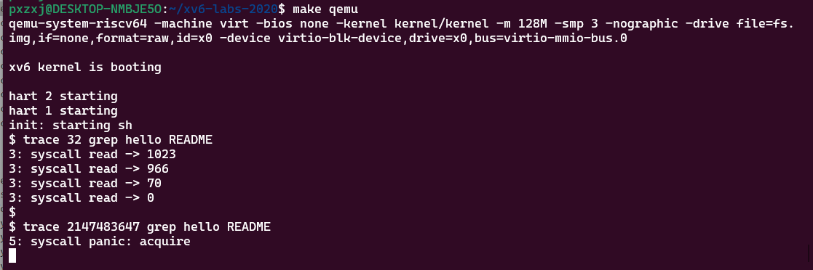

= Lab system calls

在上一个实验中，您使用系统调用编写了一些实用程序。 在本实验中，您将向 xv6 添加一些新的系统调用，这将帮助您了解它们的工作原理，并让您了解 xv6 内核的一些内部结构。 您将在以后的实验中添加更多系统调用。

[NOTE]
====
在开始编码之前，请阅读 https://pdos.csail.mit.edu/6.828/2020/xv6/book-riscv-rev1.pdf[xv6书] 的第 2 章、第 4 章的第 4.3 和 4.4 节以及相关的源代码：

* 系统调用的的用户空间代码在 user/user.h 和 user/usys.pl 中。
* 系统调用的内核空间代码在 kernel/syscall.h、kernel/syscall.c中。
* 进程相关的代码在kernel/proc.h 和 kernel/proc.c中。
====

开始编码前要先切换到syscall分支

[source,bash]
----
  $ git fetch
  $ git checkout syscall
  $ make clean
----

此时运行 `make grade` 会发现评分脚本不能执行 `trace` 和 `sysinfotest` 。 你的任务就算添加几个system call使它能正常运行。

== System call tracing

=== Requirement

************************************************
在本作业中，您将添加一个系统调用跟踪功能，该功能可能会在以后调试实验时帮助您。
你需要创建一个名称为 `trace` 的系统调用。 它需要一个名称为 `mask` 类型是integer的参数，
参数的每一位用于指定要跟踪的系统调用。 例如，执行 `trace(1 << SYS_fork)` 可以跟踪 `fork` 系统调用，
参数中的 `SYS_fork` 声明在 kernel/syscall.h 中。 你需要修改xv6内核使每个系统调用返回时判断 `mask` 参数是否设置了该系统调用，
如果设置了就需要打印进程id、系统调用名称和返回值，系统调用的参数不需要打印。如果进程执行过程中fork了子进程，那么子进程也需要打印跟踪信息，
但要注意不能影响其它进程。
************************************************

我们提供了一个名称为 `trace` 的程序，它能够运行其它程序并启用跟踪功能，执行示例如下

====
[source,bash,subs="verbatim"]
----
$ trace 32 grep hello README
3: syscall read -> 1023
3: syscall read -> 966
3: syscall read -> 70
3: syscall read -> 0
$
$ trace 2147483647 grep hello README
4: syscall trace -> 0
4: syscall exec -> 3
4: syscall open -> 3
4: syscall read -> 1023
4: syscall read -> 966
4: syscall read -> 70
4: syscall read -> 0
4: syscall close -> 0
$
$ grep hello README
$
$ trace 2 usertests forkforkfork
usertests starting
test forkforkfork: 407: syscall fork -> 408
408: syscall fork -> 409
409: syscall fork -> 410
410: syscall fork -> 411
409: syscall fork -> 412
410: syscall fork -> 413
409: syscall fork -> 414
411: syscall fork -> 415
...
$
----
====

在上面的第一个示例中，`trace` 执行 `grep` 并跟踪 `read` 系统调用。 32 等于 `1<<SYS_read`。
在第二个示例中，`trace` 执行 `grep` 并跟踪所有系统调用； 2147583647 对应的二进制数低31位都是1。
在第三个示例中，没有使用 `trace` ，所以不打印跟踪输出。
在第四个示例中，usertests 中 forkforkfork产生的所有子进程都会跟踪fork系统调用。
如果您的程序执行结果与上述示例相同（进程ID可能不同），那么表示你的代码是正确的

* 在Makefile文件的UPROGS 段添加 `$U/_trace`
* 运行 `make qemu` 你会发现编译器无法编译user/trace.c，因为系统调用的用户空间stub还不存在：
所以要在到user/user.h添加系统调用的prototype，user/usys.pl添加stub，kernel/syscall.h
添加系统调用编号。 Makefile 调用 perl 脚本 user/usys.pl会生成 user/usys.S和实际的系统调用stub，
stub会使用 RISC-V的ecall 指令转换到内核空间。 修复编译问题后，运行 `trace 32 grep hello README` 也会失败，因为你还没有在内核中实现系统调用。
* 在kernel/sysproc.c中添加一个系统调用的函数sys_trace()，该函数把它的参数使用一个新的变量记录在proc结构体中(参考kernel/proc.h)。
kernel/syscall.c中定义了获取系统调用参数的函数，你可以在kernel/sysproc.c中查看此函数的使用示例。
* 修改fork()（参考kernel/proc.c）方法，把父进程的跟踪标识复制到子进程中。
* 修改kernel/syscall.c中的syscall()函数打印跟踪信息，你需要使用一个数组保存需要跟踪的系统调用名称。

=== Answer

.Makefile
====
[source,subs="verbatim"]
----
UPROGS=\
        $U/_cat\
        $U/_echo\
        $U/_forktest\
        $U/_grep\
        $U/_init\
        $U/_kill\
        $U/_ln\
        $U/_ls\
        $U/_mkdir\
        $U/_rm\
        $U/_sh\
        $U/_stressfs\
        $U/_usertests\
        $U/_grind\
        $U/_wc\
        $U/_zombie\
        $U/_trace\              <1>
----
<1> 添加$U/_trace\
====

====
.user/user.h
[source,c,subs="verbatim"]
----
int uptime(void);
int trace(int);                <1>
----
<1> 添加用户空间stub
====

====
.user/usys.pl
[source,c,subs="verbatim"]
----
entry("trace");
----
====

====
.kernel/syscall.h
[source,c,subs="verbatim"]
----
#define SYS_trace  22
----
====

====
.kernel/proc.h
[source,c,subs="verbatim"]
----
struct proc {
  struct spinlock lock;

  // p->lock must be held when using these:
  enum procstate state;        // Process state
  struct proc *parent;         // Parent process
  void *chan;                  // If non-zero, sleeping on chan
  int killed;                  // If non-zero, have been killed
  int xstate;                  // Exit status to be returned to parent's wait
  int pid;                     // Process ID
  int tracemask;               // Trace Mask                   <1>

  // these are private to the process, so p->lock need not be held.
  uint64 kstack;               // Virtual address of kernel stack
  uint64 sz;                   // Size of process memory (bytes)
  pagetable_t pagetable;       // User page table
  struct trapframe *trapframe; // data page for trampoline.S
  struct context context;      // swtch() here to run process
  struct file *ofile[NOFILE];  // Open files
  struct inode *cwd;           // Current directory
  char name[16];               // Process name (debugging)
};
----
<1> 添加字段保存trace参数
====

====
.kernel/sysproc.c
[source,c,subs="verbatim"]
----
uint64
sys_trace(void)
{
  int mask;
  if(argint(0, &mask) < 0)
      return -1;
  myproc()->tracemask = mask;
  return 0;
}
----
====

====
.kernel/proc.c
[source,c,subs="verbatim"]
----
static void
freeproc(struct proc *p)
{
  //...
  p->tracemask = 0;      <1>
  //...
}

int
fork(void)
{
  //...
  np->tracemask = p->tracemask;         <2>
  //...
}
----
<1> 重置trace字段
<2> 复制tracemark到子进程
====

====
.kernel/syscall.c
[source,c,subs="verbatim"]
----
extern uint64 sys_trace(void);

//...

static uint64 (*syscalls[])(void) = {
  //...
  [SYS_trace]   sys_trace,
}

static char *syscall_names[] = {
        "", "fork","exit","wait","pipe","read","kill","exec",
        "fstat","chdir","dup","getpid","sbrk","sleep","uptime",
        "open","write","mknod","unlink","link","mkdir","close"
};

void
syscall(void)
{
  int num;
  struct proc *p = myproc();

  num = p->trapframe->a7;
  if(num > 0 && num < NELEM(syscalls) && syscalls[num]) {
    p->trapframe->a0 = syscalls[num]();
    int tm = p->tracemask;
    if(tm) {
      int i = 1 << num;
      if((tm & i) != 0) {
        printf("%d: syscall %s -> %d\n", p->pid, syscall_names[num], p->trapframe->a0);
      }
    }
  } else {
    printf("%d %s: unknown sys call %d\n",
            p->pid, p->name, num);
    p->trapframe->a0 = -1;
  }
}

----
====

运行第二个测试时会出现 `syscall panic` 的报错，后期再解决

== Sysinfo

=== Requirement

****
本作业中你需要添加一个名称为 `sysinfo` 的系统调用用于收集系统运行信息，它只有一个类型是
`struct sysinfo` (参考kernel/sysinfo.h) 的参数，此系统调用需要对参数的各个属性赋值，
系统的空闲内存数量赋值给 `freemem` 属性，单位是字节，进程的 `state` 值不是 `UNUSED` 的进程数量赋值
给 `nproc` 属性。我们提供了一个测试程序 `sysinfotest`，此程序运行后打印 `sysinfotest: OK` 表示执行成功。
****

一些提示：

* Makefile 的 UPROGS 段添加 `$U/_sysinfotest`;
* 运行make qemu时user/sysinfotest.c会编译失败，此时需要添加sysinfo系统调用，步骤与上一个作业类似，注意在
user/user.h中声明sysinfo()的原型前需要先声明struct sysinfo。

[source,c,subs="verbatim"]
----
struct sysinfo;
int sysinfo(struct sysinfo *);
----

解决了编译问题后运行sysinfotest还是会失败，因为此时还没有在内核中实现系统调用。

* sysinfo需要将 struct sysinfo 复制回用户空间，参考 sys_fstat() (kernel/sysfile.c) 和 filestat() (kernel/file.c) 了解  copyout() 的使用方法。
* 在 kernel/kalloc.c 中添加一个收集空闲内存的函数。
* 在 kernel/proc.c 中添加一个收集进程数量的函数。

=== Answer

.Makefile
====
[source,subs="verbatim"]
----
UPROGS=\
        $U/_cat\
        $U/_echo\
        $U/_forktest\
        $U/_grep\
        $U/_init\
        $U/_kill\
        $U/_ln\
        $U/_ls\
        $U/_mkdir\
        $U/_rm\
        $U/_sh\
        $U/_stressfs\
        $U/_usertests\
        $U/_grind\
        $U/_wc\
        $U/_zombie\
        $U/_trace\
        $U/_sysinfotest\
----
====

====
.user/user.h
[source,c,subs="verbatim"]
----
struct sysinfo;
int sysinfo(struct sysinfo*);
----
====

====
.user/usys.pl
[source,c,subs="verbatim"]
----
entry("sysinfo");
----
====

====
.kernel/syscall.h
[source,c,subs="verbatim"]
----
#define SYS_sysinfo  23
----
====

====
.kernel/sysproc.c
[source,c,subs="verbatim"]
----
extern uint64 page_count;
extern uint64 proc_count;

uint64
sys_sysinfo(void)
{
  uint64 st;
  if(argaddr(0, &st) < 0) {
    return -1;
  }
  struct sysinfo info = {page_count * PGSIZE, proc_count};
  if (copyout(myproc()->pagetable, st, (char*) &info, sizeof(info)) < 0) {
    return -1;
  }
  return 0;
}
----
====

====
.kernel/syscall.c
[source,c,subs="verbatim"]
----
extern uint64 sys_sysinfo(void);

//...

static uint64 (*syscalls[])(void) = {
  //...
  [SYS_sysinfo]   sys_sysinfo,
}

----
====

====
.kernel/kalloc.c
[source,c,subs="verbatim"]
----
uint64 page_count;

void
kfree(void *pa)
{
  //...
  page_count++;
  release(&kmem.lock);
}

void *
kalloc(void)
{
  struct run *r;

  acquire(&kmem.lock);
  r = kmem.freelist;
  if(r) {
    kmem.freelist = r->next;
    page_count--;
  }
  //...
}
----
====

====
.kernel/proc.c
[source,c,subs="verbatim"]
----
uint64 proc_count;

static struct proc*
allocproc(void)
{
  //...
  proc_count++;
  return p;
}

static void
freeproc(struct proc *p)
{
  //...
  proc_count--;
}
----
====